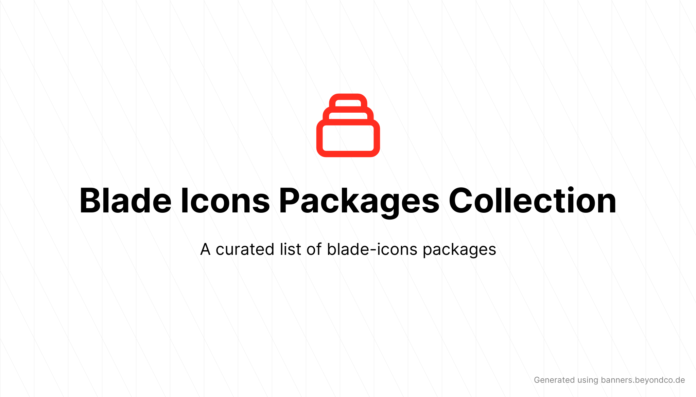

<p align="center">
    
</p>

# Blade Icons Package Collection

<!-- <a href="https://github.com/codeat3/blade-icons-packages-collection/actions?query=workflow%3ATests">
    
</a> -->
<a href="https://packagist.org/packages/codeat3/blade-icons-packages-collection">
    
</a>
<a href="https://packagist.org/packages/codeat3/blade-icons-packages-collection">
    
</a>

A repository is the collection of all the blade-icons packages listed on [Blade Icons README](https://github.com/blade-ui-kit/blade-icons) or available elsewhere.

## How to contribute?
* To add a new package to the list, simply update the `collections.yml` file with the following details

Eg:
```
  -
    package: codeat3/blade-game-icons
    name: 'Blade Game Icons'
    latest_version: ''
    listed_on_blade_icon_readme: 0
    original_package:
      name: 'Game Icons'
      url: 'https://github.com/game-icons/icons'
```

All the following fields are optional, they are updated periodically through a workflow
```
    versions:
      - dev-main
      - 1.0.0
    maintainers:
      -
        name: swapnilsarwe
        avatar_url: 'https://www.gravatar.com/avatar/0a4d4844e866bb689ea4602071e9dfe7?d=identicon'
    downloads: 1382
    stars: 0
```

Feel free to create an issue if you have any suggestions or questions.

## Maintainers

Blade Icons Packages Collection is developed and maintained by [Swapnil Sarwe](https://swapnilsarwe.com).

## License

Blade Icons Packages Collection is open-sourced software licensed under [the MIT license](LICENSE.md).
